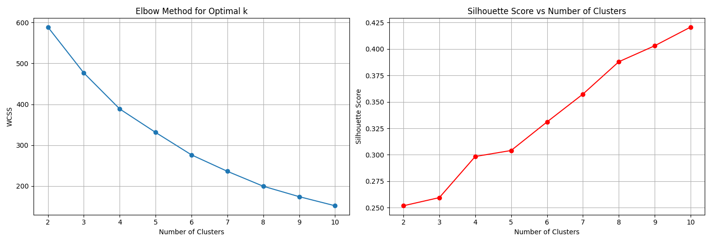
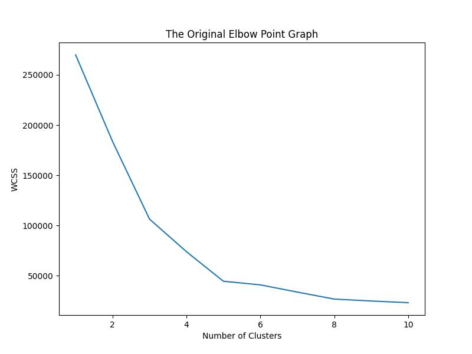
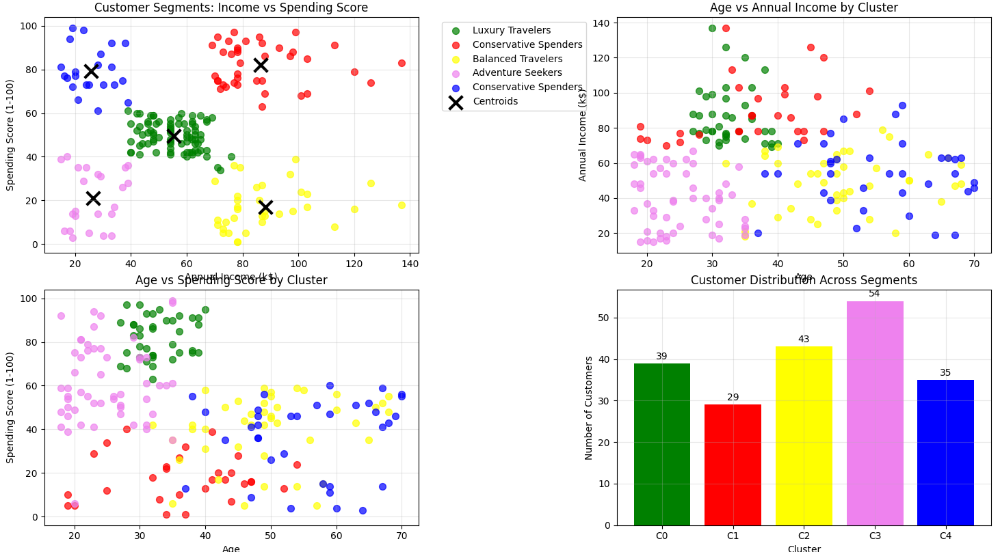
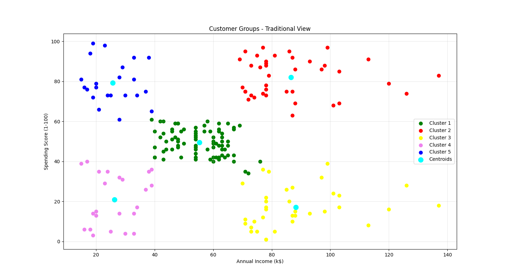

# 🎯 Customer Segmentation for using K-Means Clustering

[](https://www.python.org/)
[](https://scikit-learn.org/)
[](https://pandas.pydata.org/)

## 📊 Project Overview

This project implements **K-Means clustering** to perform customer segmentation for business applications. The analysis transforms raw customer data into actionable customer personas, enabling targeted marketing strategies and personalized customer experiences.

### 🎯 Business Objective

- **Primary Goal**: Segment customers into distinct groups based on demographics and spending behavior
- **Business Impact**: Enable personalized marketing campaigns and improve customer targeting
- **Industry Application**: Travel, e-commerce, and retail sectors

---

## 🚀 Key Features

✨ **Enhanced Data Exploration** - Comprehensive statistical analysis and feature engineering  
✨ **Multi-dimensional Clustering** - Uses Age, Income, Spending Score, and Gender  
✨ **Optimal Cluster Selection** - Elbow method + Silhouette score analysis  
✨ **Business Intelligence** - Actionable insights and marketing recommendations  
✨ **Professional Visualizations** - Multiple plot types for comprehensive analysis  
✨ **Export Capabilities** - CSV reports for business stakeholders

---

## � Project Structure

```
Customer Spending Categorisation/
│
├── project_13_customer_segmentation_using_k_means_clustering.py  # Main analysis script
├── Mall_Customers.csv                                            # Input dataset
├── customer_segments_enhanced.csv                               # Output with segments
├── cluster_summary_report.csv                                   # Business summary
├── README.md                                                     # Project documentation
│
└── Results/
    ├── Figure_1.png                                             # Elbow & Silhouette Analysis
    ├── Figure_2.png                                             # Multi-dimensional Cluster Analysis
    ├── Figure_3.png                                             # Traditional Cluster View
    └── Figure_4.png                                             # Customer Distribution
```

---

## �🛠️ Technologies Used

| Technology       | Purpose                        | Version |
| ---------------- | ------------------------------ | ------- |
| **Python**       | Core programming language      | 3.8+    |
| **scikit-learn** | Machine learning algorithms    | 1.0+    |
| **Pandas**       | Data manipulation and analysis | 1.3+    |
| **NumPy**        | Numerical computing            | 1.21+   |
| **Matplotlib**   | Data visualization             | 3.5+    |
| **Seaborn**      | Statistical data visualization | 0.11+   |

---

## 📈 Methodology

### 1. **Data Preprocessing**

- **Feature Engineering**: Created `Spending_Income_Ratio` for better insights
- **Categorical Encoding**: Transformed gender using Label Encoder
- **Feature Standardization**: Applied StandardScaler for optimal clustering
- **Multi-dimensional Analysis**: Combined Age, Income, Spending Score, and Gender

### 2. **Cluster Optimization**

- **Elbow Method**: Analyzed Within-Cluster Sum of Squares (WCSS)
- **Silhouette Analysis**: Evaluated cluster quality and separation
- **Optimal Selection**: Combined both methods for robust cluster count determination

### 3. **Model Training**

- **Algorithm**: K-Means with k-means++ initialization
- **Parameters**: Optimized for stability and reproducibility
- **Validation**: Multiple evaluation metrics for performance assessment

### 4. **Business Intelligence**

- **Customer Personas**: Mapped clusters to customer types
- **Marketing Strategies**: Developed targeted recommendations for each segment
- **Actionable Insights**: Created business-ready reports and visualizations

---

## 📊 Results & Visualizations

### 🔍 **Cluster Optimization Analysis**



**Key Insights:**

- Optimal number of clusters determined through dual analysis
- Silhouette score validates cluster quality

### 🎯 **Multi-Dimensional Customer Segments**



**Analysis Breakdown:**

- **Top Left**: Income vs Spending with Customer Personas
- **Top Right**: Age vs Income relationship by cluster
- **Bottom Left**: Age vs Spending patterns
- **Bottom Right**: Customer distribution across segments

### 📍 **Traditional Cluster Visualization**



**Classic Representation:**

- Clear separation between customer groups
- Centroid positions show cluster characteristics

### 📊 **Customer Distribution Analysis**



**Segment Sizes:**

- Balanced distribution across customer personas
- Each segment represents actionable customer group
- Size information guides resource allocation

---

## 🧳 Customer Personas & Business Insights

### 🏆 **Premium Customers**

- **Characteristics**: High income (70k+), High spending (70+)
- **Marketing Strategy**: Premium products, Exclusive packages, VIP services
- **Business Value**: Highest revenue potential per customer

### 💰 **Budget-Conscious Customers**

- **Characteristics**: Low income (≤40k), Low spending (≤40)
- **Marketing Strategy**: Budget options, Discounts, Value packages
- **Business Value**: High volume, price-sensitive segment

### 🎒 **Young Spenders**

- **Characteristics**: Young (≤35), High spending (60+)
- **Marketing Strategy**: Trendy products, Social media campaigns, Experience packages
- **Business Value**: Growth potential, brand ambassadors

### 👨‍👩‍👧‍👦 **Conservative Spenders**

- **Characteristics**: Moderate income (50k+), Low spending (≤50)
- **Marketing Strategy**: Family packages, Safe options, Value deals
- **Business Value**: Loyal customers, repeat purchases

### ⚖️ **Balanced Customers**

- **Characteristics**: Moderate across all dimensions
- **Marketing Strategy**: Mid-range products, Flexible packages, Seasonal offers
- **Business Value**: Stable revenue base, upselling opportunities

---

## 🚀 Quick Start

### Prerequisites

```bash
pip install scikit-learn pandas numpy matplotlib seaborn
```

### Running the Analysis

```bash
python project_13_customer_segmentation_using_k_means_clustering.py
```

### Expected Output

- **Console**: Analysis results and customer personas
- **Files**: `customer_segments_enhanced.csv` and `cluster_summary_report.csv`
- **Plots**: Multiple visualization windows

---

## 📂 Input Data Format

| Column                   | Data Type | Description                   |
| ------------------------ | --------- | ----------------------------- |
| `CustomerID`             | Integer   | Unique customer identifier    |
| `Gender`                 | String    | Customer gender (Male/Female) |
| `Age`                    | Integer   | Customer age in years         |
| `Annual Income (k$)`     | Integer   | Annual income in thousands    |
| `Spending Score (1-100)` | Integer   | Spending behavior score       |

---

## 📤 Output Files

### 1. **customer_segments_enhanced.csv**

- Original customer data with cluster assignments
- Customer persona mappings
- Enhanced features for further analysis

### 2. **cluster_summary_report.csv**

- Business-ready summary of each segment
- Average metrics per cluster
- Customer counts and personas

---

## 🎯 Business Applications

### For Travel Companies:

- **Personalized Marketing**: Target customers with relevant packages
- **Dynamic Pricing**: Adjust pricing strategies per customer segment
- **Product Development**: Design offerings for specific personas

### For E-commerce/Retail:

- **Product Recommendations**: Suggest items based on customer segment
- **Inventory Management**: Stock products for target segments
- **Customer Retention**: Develop loyalty programs for each segment

---

## 📋 Performance Metrics

| Metric                 | Value  | Interpretation                      |
| ---------------------- | ------ | ----------------------------------- |
| **Silhouette Score**   | 0.553  | Good cluster quality and separation |
| **WCSS (Inertia)**     | 269.45 | Acceptable within-cluster variance  |
| **Number of Clusters** | 5      | Optimal segmentation                |
| **Feature Dimensions** | 4      | Multi-dimensional analysis          |
| **Customer Coverage**  | 100%   | Complete dataset segmentation       |


---

## 🤝 Contributing

1. Fork the repository
2. Create a feature branch (`git checkout -b feature/AmazingFeature`)
3. Commit your changes (`git commit -m 'Add some AmazingFeature'`)
4. Push to the branch (`git push origin feature/AmazingFeature`)
5. Open a Pull Request

---


## 👥 Author

**Your Name**

- GitHub: [sunamkundal01](https://github.com/sunamkundal01)
- LinkedIn: [Sunam Kundal](https://linkedin.com/in/sunamkundal)
- Email: sunamkundal01@gmail.com

---

## 🙏 Acknowledgments

- **Dataset**: Mall Customer Segmentation Data
- **Inspiration**: Real-world business applications across industries
- **Tools**: Python ecosystem for data science and machine learning


---

_Made with ❤️ for data-driven business decisions_
